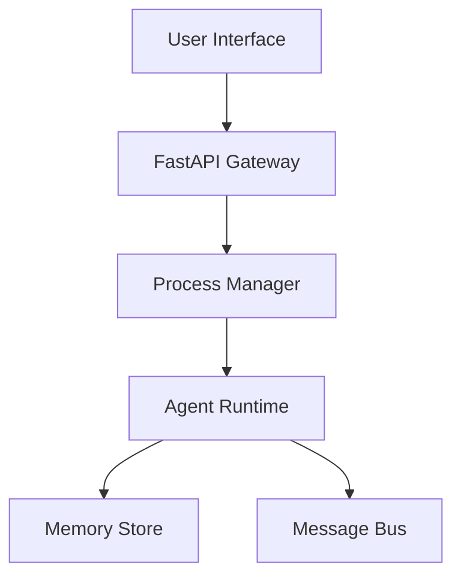

# GhostOS Alpha

> The Meta-Kernel for Agent Autonomy.

GhostOS is a high-performance, modular meta-kernel designed to orchestrate autonomous agents with surgical precision. It provides the low-level abstractions for process management, persistent memory, and cross-agent communication.

## Core Features

- **Autonomous Process Management:** Real-time lifecycle control via FastAPI and PM2 integration.
- **Inter-Agent Messaging:** Low-latency event stream for collaborative agent intelligence.
- **Stateful Persistence:** Schema-driven state management with Supabase and Redis support.
- **Infrastructure as Code:** Fully automated deployment via Terraform and Docker.

## Architecture



## Getting Started

### Prerequisites

- Python 3.11+
- `uv` (Fast Python package manager)
- Docker

### Installation

```bash
uv pip install -r requirements.txt
uv run uvicorn app.main:app --reload
```

## Engineering Standards

GhostOS follows the **Surgical Engineering** principles:
- **Strict Typing:** 100% Pydantic models for every interface.
- **Modular Design:** Decoupled logic for memory, messaging, and execution.
- **Obsessive Documentation:** Every module is a story.

---
*Built by Cells // WithinCells-Interlinked*
